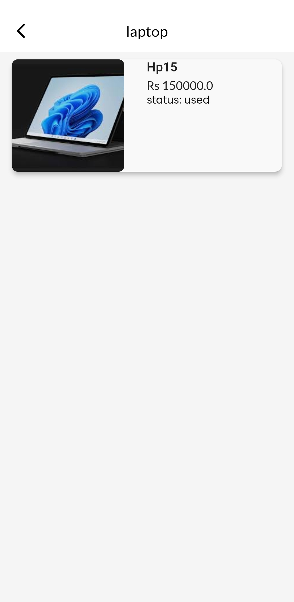
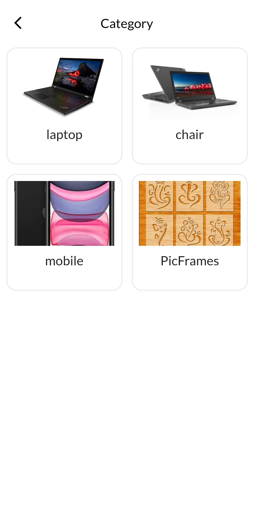
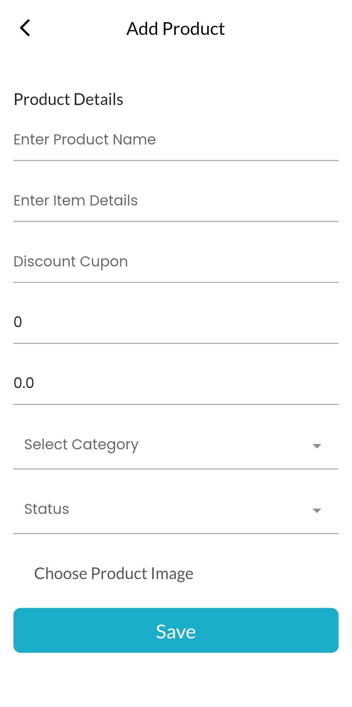
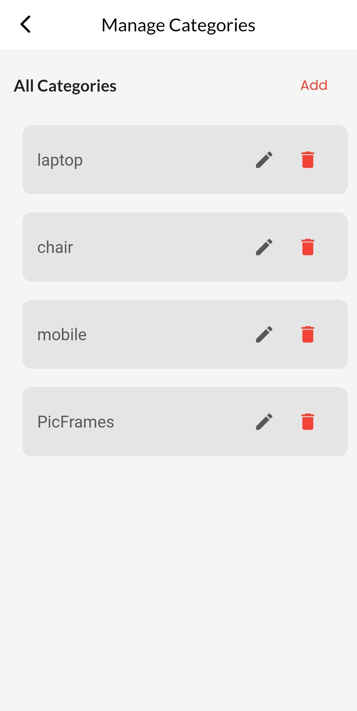
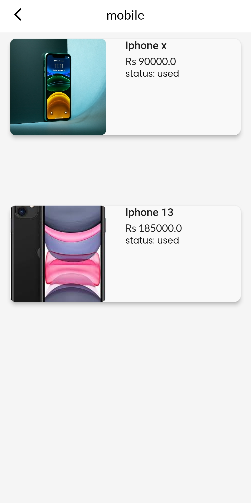
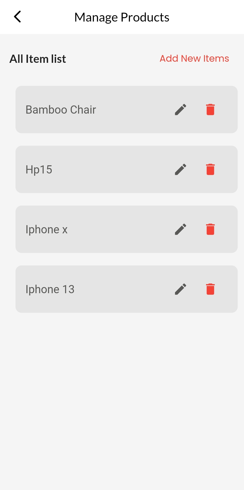
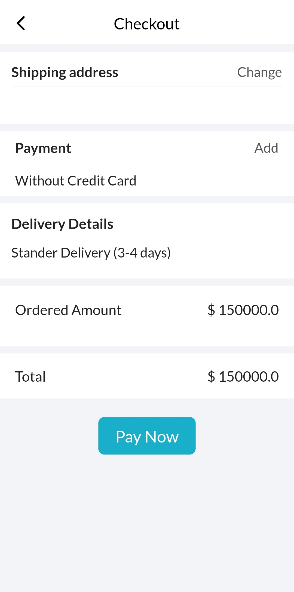
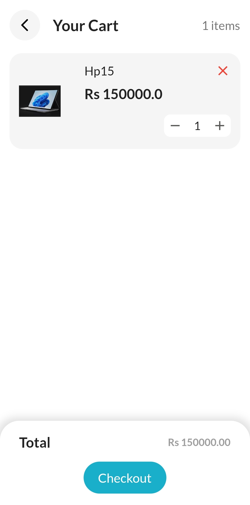
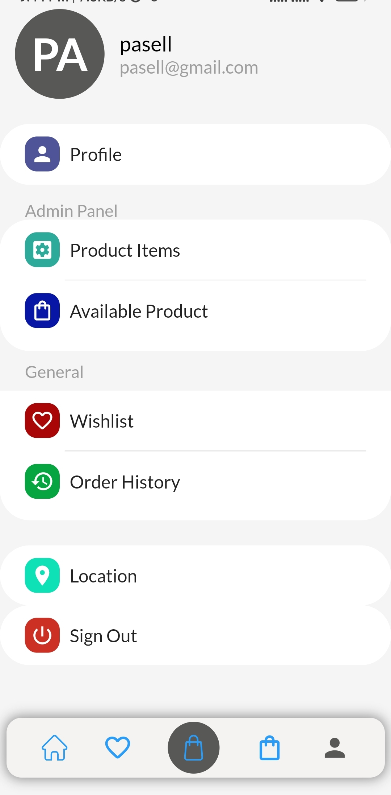

# pasell
Some Screengrab of our project wrok done Team_Particles.

# ScreenShots

  
  
  
  

# ScreenShots

  
  
  
  

# ScreenShots

  
  
  
  

# ScreenShots

  
  
  
  

# ScreenShots

  
  
  
  

